# IRsim Architecture and Delivery Status

> **Central architecture record — updated 2026-07-17.** This is the source of truth for the
> local-DICOM product direction, current implementation, verified gates, and next work.
> Physics-specific state remains in `physics-fidelity-refactor-progress.md`.

## 1. Product boundary

IRsim has two in-tab anatomy sources that share the same simulator:

1. **Built-in public demo.** Synthetic/generic anatomy. Always available without files or a network
   after the application has loaded.
2. **Local DICOM case.** Operator-selected CT slices are read, segmented, converted to simulator
   geometry, reviewed, and activated in one browser tab. Patient files are not uploaded and are not
   intentionally written to browser storage or IRsim servers.

The local case is a **prototype rehearsal feature**, not a diagnostic segmentation or patient-specific
clinical planning device. Patient-derived pixels and geometry may still be identifiable health data.
“Local/session-only” describes handling; it does not mean the anatomy has been de-identified.

## 2. Delivery decision: web first

The functional v1 stays on the web. The browser already provides the required local-file access,
dedicated workers, typed-array computation, WebGL rendering, and no-install delivery. A desktop shell
would add packaging and update complexity without improving the current single-trunk algorithm.

Move the processing adapter to desktop/native when any of these becomes a requirement:

- Whole vascular-tree AI/GPU inference or full-volume vesselness and topology repair.
- Compressed/multiframe studies that exceed the packaged browser decoder envelope.
- Processing working sets near 1 GiB, large multiphase/4D volumes, or repeatable workstation-class jobs.
- DIMSE PACS connectivity; the browser should only ever use DICOMweb.
- Predictive device deployment, CFD, haptics, or controlled native-runtime reproducibility.

Keep React, the review workflow, the `AnatomyDoc` seam, and Three.js visualization in both delivery
forms. Only the imaging adapter should change.

## 3. Current end-to-end data flow

```mermaid
flowchart LR
  Files["Local DICOM CT files"] --> Session["openLocalDicomSession Interface"]
  Session --> Worker["Dedicated local Web Worker"]
  Worker --> Parser["Sequential native or JPEG 2000 Lossless HU decoding"]
  Parser --> Volume["Canonical diagnostic-volume Interface"]
  Volume -.->|"Best effort"| Proposal["Automatic single-trunk proposal"]
  Volume --> Frame["Unified requested source-plane RGBA frame"]
  Proposal --> Frame
  Frame --> Map["Opaque bounded frame token maps selection inside worker"]
  Map --> Seed["Operator vascular seed"]
  Seed --> Segment["Bidirectional seed-connected tracking"]
  Segment --> Labelmap["Editable sparse per-slice labelmap"]
  Labelmap --> Edit["Replace component, apply bounded 3D brush, trim endpoints, or undo"]
  Edit --> Topology["Continuity, radius, gap and component checks"]
  Topology -->|"Blocked: no simulator document"| Edit
  Topology -->|"Pass"| Checkpoints["Render bounded source frames plus seed-aligned patient LPS MPR"]
  Checkpoints --> Review["Current-revision overlay plus session edit provenance"]
  Review -->|"Separate review attestation"| Gate["Simulator-ready validation"]
  Gate -->|"Explicit load"| Doc["Identifier-free AnatomyDoc in memory"]
  Doc --> Sim["Lumen physics plus variable-radius rendering"]
  Clear["Close/retry/load/pagehide"] --> Worker
  Clear --> Doc
  Clear --> Sim
```

Processing is atomic: the active simulator remains unchanged during reading, failure, cancellation,
and review. Source-image review still opens when no automatic proposal can be built. An automatic
proposal is never loadable. The operator must select a source-image voxel,
successfully track that connected component, review the seeded overlay in the original acquisition
images and patient LPS reformats, and separately attest
that it is the intended trunk. After tracking, an operator can replace the threshold-connected
component on one reviewed source slice, apply a 0.5–10 mm physical add/remove sphere around a source
voxel selected in any displayed plane, discard tracked samples before or after a reviewed boundary,
or undo the last change. The brush touches only already tracked slices, materializes one temporary 2D
mask at a time, preserves the confirmed seed, and rebuilds the full reviewed path from its updated
spans. Trimming must retain the original confirmed seed, use a currently tracked
source slice, retain the minimum safe path length, and remove at least one sample. The worker rebuilds
smoothed centerline/radius geometry from the retained sparse components rather than slicing stale
smoothed values. Every action receives an identifier-free revision record and invalidates prior
checkpoint evidence, source-frame mapping tokens, and attestation. Patient geometry and display-to-
voxel transforms stay in the worker; React receives only one RGBA frame and an opaque session-local
token. At most eight frame mappings are retained, and the editable sparse labelmap is the sole owner
of the current reviewed overlay. A discontinuity, abrupt radius
change, empty component, duplicate slice, or excessive source-slice gap blocks attestation and causes
the result to carry no simulator document. For every new segmentation revision, the operator must
also open a bounded axial acquisition-plane checkpoint set (first, quartiles, last, and explicit seed)
plus seed-aligned patient-coronal and patient-sagittal context frames. Attestation remains disabled until every
corresponding seeded-overlay frame has rendered for that exact revision. Edit,
undo, and re-track results reset this checkpoint evidence. Only “Load reviewed anatomy” commits a
topology-passing, checkpoint-reviewed, separately attested document and restarts the run. This is a
forcing function for distributed source review. The patient axial/coronal/sagittal views are
deterministic, isotropically sampled LPS reformats built directly from the canonical HU volume:
trilinear interpolation presents HU, nearest-neighbour membership preserves the discrete sparse
labelmap, fixed R/L/A/P/H/F labels make display orientation explicit, and clicks in tilted-volume
padding fail closed. They are engineering review MPR, not a validated diagnostic workstation,
arbitrary oblique/curved MPR, or a replacement for full-volume clinical sign-off.

The viewport advances device physics through a fixed 60 Hz accumulator with at most two catch-up
steps per render frame. Display refresh rate and browser scheduling therefore do not change the
calibrated solver trajectory; visual, procedure-time, fluoroscopy-time, and dose clocks continue to
use bounded real elapsed time.

## 4. Module map and seams

| Module | Interface | Implementation hidden behind it |
|---|---|---|
| `src/imaging/local-dicom.ts` | `openLocalDicomSession(files, options)` and `LocalDicomSession` | File limits, request correlation, unified frame/mapping requests, worker lifecycle, cancellation, cleanup |
| `src/imaging/worker-protocol.ts` | Request-correlated worker messages | Identifier-free summary/frame/result boundary; no pixel-volume response |
| `src/imaging/local-dicom.worker.ts` | One stateful worker session | Sequential file reads, isolated CPU processing; no network or storage adapter |
| `src/imaging/process-dicom.ts` | `DicomFileSource` and `LocalDicomProcessor` | Minimal sequential-read seam for browser `File`/lazy fixture sources; canonical diagnostic volume, proposal, bounded frame-token mapping, seeded tracking, conversion, disposal |
| `src/imaging/dicom-volume.ts` | `CtSliceDecoder` and `CtVolume` | Part 10 parsing, native/JPEG 2000 Lossless pixel Adapters, HU rescale into the sole borrowed slice store, patient geometry/voxel transforms, sorting, validation, disposal |
| `src/imaging/source-plane-review.ts` | `renderSourceReview` and `sourceVoxelFromRenderedFrame` | One worker-only acquisition-source/patient-MPR projection and selection-mapping Seam; public frames omit patient geometry |
| `src/imaging/axial-review.ts` | `renderAxialReview` | DICOM linear windowing, MONOCHROME1 inversion, exact overlay runs, seed marker |
| `src/imaging/patient-mpr.ts` | `renderPatientMprReview`, patient-plane checkpoint location, and opaque point mapping | Exact per-slice IPP bracketing, tilted/irregular-stack geometry, bounded isotropic LPS grids, trilinear HU, discrete labelmap sampling, padding validity, seed projection, fixed orientation labels, and temporary-plane clearing |
| `src/imaging/vessel-segmentation.ts` | proposal, seed tracking, and reviewed-voxel transforms | Connected components, bounded continuity candidates, bidirectional path, physical 3D brush kernel, geometry rebuild |
| `src/imaging/segmentation-review.ts` | `EditableSegmentationReview` | Sparse labelmap ownership, bounded undo snapshots, revision provenance, span/connectivity and path topology review |
| `src/imaging/review-gate.ts` | `canLoadReviewedLocalDicom` | Seed + loadable document + topology pass + separate acquisition/patient-MPR review completion + approval + idle-worker invariant |
| `src/sim/anatomyDoc.ts` | `validateSimulatorReadyAnatomyDoc` and `compileAnatomy` | Resource/number/access/target validation and runtime graph creation |
| `src/three/vesselGeometry.ts` | `makeVesselGeometry(points)` | Parallel-transport tube loft preserving each point’s lumen radius |
| `src/three/Viewport.tsx` | fixed-step simulation host and dev-only telemetry | 60 Hz physics accumulator, rendering, GPU lifecycle, honest browser-smoke metrics |
| `scripts/fetch-jpeg2000-ct-fixtures.mjs` + `scripts/jpeg2000-ct.fixture.test.ts` | opt-in `FixtureCorpus` gate | Per-object/file/frame/fragment hashes, rights/provenance retention, DCMTK/GDCM real-pixel interoperability, exact independent HU/geometry oracles, BOT/fragment and truncation variants |
| `scripts/dicom-study-budget.fixture.test.ts` | opt-in full-study intake budget | Lazy 538-slice sources through the production processor Interface, prior-buffer clearing checks, canonical-byte accounting, and broad sampled Node process memory/runtime ceilings |
| `scripts/dicom-compressed-study.fixture.test.ts` | opt-in compressed full-study preflight | Exact 538-object fingerprint, production JPEG 2000 decode, pinned proposal, seeded tracking, and patient-MPR review over the deterministic real-pixel derivative |
| `scripts/browser-dicom-smoke.mjs --study-benchmark` | compressed browser-worker evidence lane | Exact fixture fingerprint, flat worker auto-attach, first-review/seeded/MPR timings, sampled page/worker heap plus backing storage, close/worker termination, storage and network silence |

This is a deep local-imaging Module: React does not know transfer syntaxes, DICOM tags, volume
orientation, connected-component mechanics, coordinate transforms, or worker protocol. The worker
owns the only canonical Int16 HU representation and editable sparse labelmap. Segmentation and
rendering borrow slice views through `CtVolume`; decoder grouping identifiers and scalar disposal stay
behind that Interface. A short-lived `CtSliceDecoder` context is reused across sequential source files,
then disposed before segmentation. Native and compressed Implementations copy/rescale directly into
each final `Int16Array`; the compressed path may own only one transient codec byte view. The main thread
receives an identifier-free summary, at most one requested RGBA
frame with an opaque bounded token, bounded edit/topology metadata, and a
validated document only for topology-passing revisions. `LocalDicomProcessor` is the deterministic
test surface. A separate native-runtime processing Adapter should only be introduced when desktop
work actually begins; until then a backend-neutral processing Interface would be hypothetical.

## 5. Supported v1 input envelope

- DICOM Part 10, CT modality, single-frame monochrome slices.
- Implicit VR Little Endian, Explicit VR Little Endian, Explicit VR Big Endian, or JPEG 2000
  Lossless (`1.2.840.10008.1.2.4.90`). Lossy JPEG 2000 (`...4.91`) is explicitly rejected.
- At least 3 and at most 2,000 files; total selected bytes at most 768 MiB.
- Matrix up to 2,048 × 2,048 and selected volume up to 300 million voxels.
- Required Image Position Patient, Image Orientation Patient, Pixel Spacing, Pixel Data, and pixel
  representation metadata.
- Exactly one Study/Series Instance UID and matrix group is accepted. Mixed series or inconsistent
  matrices fail closed until the source-image review UI can present an explicit series chooser;
  slices are ordered by orientation and position, not filename.
- Stored values are rescaled to HU. The JPEG 2000 Adapter requires an encapsulated raw codestream,
  reversible single-component frame, exact DICOM matrix agreement, supported 1–16-bit SIZ precision,
  a standard empty or single-zero Basic Offset Table for the declared single frame, and exact
  preflight-versus-codec metadata agreement. Per DICOM PS3.5 §8.2.4, SIZ precision/sign
  control decompression when DICOM Bits Stored/Pixel Representation disagree; dimensions remain
  fail-closed because patient geometry would otherwise be ambiguous. JP2 file boxes are explicitly
  rejected as non-conformant DICOM Pixel Data. Other compressed syntaxes, color, multiframe, malformed, inconsistently oriented,
  or implausibly spaced inputs fail closed with an identifier-free operator error.

The current segmentation first proposes one coherent bright tubular trunk within HU and area settings.
The operator then seeds the intended connected component on an original acquisition image or a
patient MPR; every displayed selection is sent back with its opaque frame token and maps to one
canonical source voxel inside the worker. The seeded tracker
retains that component even in crowded slices, carries bounded continuity candidates in both
directions, emits exact per-row overlay runs, smooths center/radius, orders the result
inferior-to-superior in DICOM LPS space, and converts millimetres to IRsim’s left/superior/anterior
centimetre frame. Its exact spans then become the worker-owned editable sparse labelmap. A replacement
seed swaps one source-slice component atomically. A bounded physical 3D brush adds/removes reviewed
voxels across intersecting tracked slices from source or patient-MPR selection; it does not grow new
untracked slices. Endpoint controls retain only the reviewed acquisition-slice range around the
original seed. Every change recomputes geometry/topology/checkpoints and can be undone without erasing
the session edit record. This remains a sparse single-trunk review model: it can still
bridge adjacent high-attenuation anatomy and is not a complete arterial-tree segmentation or full
voxel labelmap editor.

## 6. Best-performing target imaging stack

The present `dicom-parser` plus exact-pinned OpenJPEG Adapter is deliberately small and now provides
native and JPEG 2000 Lossless intake plus tested axial source-image
review plus fixed patient LPS axial/coronal/sagittal MPR from the same canonical HU volume, without
a second decoded volume. Exact per-slice IPP geometry and trilinear HU interpolation now replace the
interim acquisition-row/column reformats; sparse labelmap sampling remains discrete and validity-aware.
It is not the final diagnostic-imaging stack: it does not provide arbitrary oblique/curved MPR,
MIP slabs, measurements, annotations, or validated diagnostic presentation. Source checkpoints retain
their acquisition-plane role, while two distinct patient-MPR context obligations are also required
for each revision. Broader codec coverage, diagnostic patient-axis tooling, and interoperability
still require one coordinated **Cornerstone3D 5.x** stack for
stack/volume rendering, MPR/MIP, editing, and DICOM SEG:

- `@cornerstonejs/core` for stack/volume/MPR rendering.
- `@cornerstonejs/dicom-image-loader` for local Part 10 and packaged compressed codecs.
- `@cornerstonejs/tools` for seed placement and mask correction.
- `@cornerstonejs/adapters` for DICOM SEG/SR interoperability.
- `@cornerstonejs/polymorphic-segmentation` plus packaged polyseg WASM only when labelmap/surface
  conversion is implemented.

Cornerstone's image-loader Interface accepts local `File` objects, and its volume viewports provide
orthographic multiplanar viewing. Its official React/Vite guidance requires a CommonJS transform for
`dicom-parser`, dependency-optimization exclusions/includes, and ES-format workers. The stack also
introduces explicit image-loader, metadata-provider, volume-loader, cache, rendering-engine, and tool
lifecycle responsibilities. For that reason it must replace the current decoder/session coherently;
adding it beside the existing full HU volume would create two canonical volumes and unacceptable
alignment, memory, and privacy ambiguity. Use one decoder and one canonical labelmap; do not decode a
full volume independently in Cornerstone and ITK-Wasm.

The 2026-07-16 integration research found that Cornerstone 5.x now treats its image cache as the single
pixel source and exposes targeted volume access through `VoxelManager`; rebuilding a complete scalar
array is explicitly discouraged. That validates IRsim's one-representation rule but exposes the next
hard seam: Cornerstone rendering owns a browser-side image cache while IRsim processing is currently
worker-owned. Do not install a parallel viewer as a shortcut.

The first narrower codec proof is now implemented without adopting that second cache. IRsim pins
`@cornerstonejs/codec-openjpeg` 1.3.0—the same direct codec version used by the researched
`@cornerstonejs/dicom-image-loader` 5.4.17 cohort—and dynamically imports only its `/decode` entry in
the DICOM worker. Each `J2KDecoder` is deleted after one frame; its returned bytes are best-effort
zeroed; and the session codec reference is dropped before segmentation. Before codec output
allocation, the Adapter bounds encoded bytes and reads mandatory raw JPEG 2000 SOC/SIZ metadata to
require the DICOM matrix, one component, and supported precision while using the codestream's
precision/sign to control decompression as required by PS3.5. It rejects JP2 boxes, validates the codec
result again after decoding, and best-effort clears the contiguous encoded-frame copy plus codec-owned
input/output views on all paths. Vite emits the decoder as
a separate self-hosted JavaScript chunk, while uncompressed import never enters that code path. This
is an intentional Adapter with leverage: both pixel paths feed the existing canonical-volume
Interface and no Cornerstone image cache or second scalar volume exists.

The proof now includes exact generated round trips plus two content-pinned real-pixel CT objects
written by different DICOM implementations: a DCMTK 3.6.2 object with a known 16-bit-header/14-bit-SIZ
mismatch and paired uncompressed reference, and a GDCM 3.0.4 TCIA-origin transcode with an independently
pinned HU digest. It covers populated/empty BOTs, a deterministic empty-BOT three-fragment derivative,
and bounded truncations. These are still real-pixel **transcodes**, not scanner-originated compressed
series; writer metadata does not prove the JPEG 2000 encoder. The 538-slice arterial fixture now has
both a native production-processor budget and a deterministic 538-slice JPEG 2000 Lossless derivative.
The compressed derivative is encoded sequentially with the same OpenJPEG family used by the product,
so it proves throughput and exact production-path behavior only—not independent-codec or vendor
interoperability. Its content-pinned Node preflight passes, and the browser runner now auto-attaches to
the dedicated worker and records sampled heap/backing-storage plus phase timings and termination. A
completed real-browser benchmark report and a second independent JPEG 2000 codec remain open. Before introducing Cornerstone rendering, prove
that its cache can become the sole canonical source consumed through borrowed/streamed slice views; if
that proof fails, stop and redesign the cache/worker seam.

Use **ITK-Wasm** only for cropped, deterministic processing pipelines that benefit from ITK kernels and
worker-pool execution. Use **vtk.js** only for derived image/mesh algorithms the existing Three.js
runtime does not cover. For desktop whole-tree work, use GDCM/DCMTK + ITK/SimpleITK + VTK/VMTK behind
the same imaging interface.

Primary references:

- [Cornerstone3D overview](https://www.cornerstonejs.org/docs/getting-started/overview/)
- [Cornerstone Vite integration](https://www.cornerstonejs.org/docs/getting-started/vue-angular-react-etc/)
- [Cornerstone image loaders and local files](https://www.cornerstonejs.org/docs/concepts/cornerstone-core/imageloader/)
- [Cornerstone codecs source and supported transfer syntaxes](https://github.com/cornerstonejs/codecs)
- [DICOM PS3.5 JPEG 2000 Image Compression](https://dicom.nema.org/medical/dicom/current/output/chtml/part05/sect_8.2.4.html)
- [DICOM PS3.5 encapsulated Pixel Data and Basic Offset Tables](https://dicom.nema.org/medical/dicom/current/output/chtml/part05/sect_A.4.html)
- [Cornerstone viewports and MPR](https://www.cornerstonejs.org/docs/concepts/cornerstone-core/viewports/)
- [Cornerstone cache](https://www.cornerstonejs.org/docs/concepts/cornerstone-core/cache/)
- [Cornerstone VoxelManager](https://www.cornerstonejs.org/docs/concepts/cornerstone-core/voxelManager)
- [ITK-Wasm documentation](https://docs.itk.org/projects/wasm/en/latest/)
- [DICOM PS3.18 web services](https://dicom.nema.org/medical/dicom/current/output/html/part18.html)
- [DICOM PS3.15 confidentiality profiles](https://dicom.nema.org/medical/dicom/current/output/chtml/part15/chapter_e.html)

## 7. Privacy and local-only invariants

The defensible product statement is:

> Patient files and derived case data are processed locally in this browser tab. IRsim does not
> transmit them or intentionally persist them to IRsim servers or browser storage.

Implementation requirements:

- No upload route, cloud fallback, analytics, telemetry, remote error reporting, cookies, localStorage,
  sessionStorage, IndexedDB, OPFS, Cache Storage, or service worker.
- No patient/file/study/series identifiers in the result, visible case name, errors, URLs, logs, or
  production debug interfaces.
- Session edit records contain only monotonically increasing revision, action, source-voxel location,
  physical brush radius/affected counts when applicable, and source-slice index; they are bounded in
  memory and cleared with the worker. They are not a durable clinical audit log.
- Source-frame checkpoint state contains only the current segmentation revision, bounded axial source
  slice indices, and seed row/column reformat descriptors. It lives in React memory, is reset on every derived revision/close, and is neither a
  durable audit record nor evidence that a clinician interpreted the frame correctly.
- DICOM parser diagnostics and raw modality/transfer-syntax values are not reflected to the UI.
- The worker reads and decodes one `File` at a time; raw bytes are best-effort overwritten after HU
  conversion, Study/Series UIDs are blanked once coherent grouping is proven, and contiguous encoded
  JPEG 2000 copies plus codec-owned input/output views are best-effort overwritten on every path.
  Per-frame decoder objects are deleted, the codec context is released before segmentation, and canonical HU arrays are
  best-effort overwritten on disposal. This is memory hygiene, not a secure-zeroization guarantee.
- Production `connect-src 'none'`; scripts/workers/assets are self-hosted. Static host request logs may
  still contain ordinary request metadata such as IP address and browser type.
- `Close case & clear session`, `pagehide`, and a restored back-forward cache clear the in-memory
  document, measurements, metrics, debug history, and active run. Anatomy changes dispose owned
  Three.js geometry, materials, and render targets.
- The application cannot promise secure zeroization of browser/OS/GPU memory, swap, crash dumps,
  screenshots, extensions, or operator-created exports.

DICOM explicitly warns that attribute removal alone does not guarantee an information object is
de-identified, and pixel identifiers need separate handling. That is why v1 avoids the word
“anonymous” in user-facing claims even though it retains no identifying tags.

## 8. Quality and verification gates

### Implemented gates

- Parser refuses unsupported modalities, transfer syntaxes, pixel encodings, matrices, and sizes.
- JPEG 2000 Lossless intake accepts only transfer syntax `1.2.840.10008.1.2.4.90`, encapsulated
  single-frame monochrome data, a raw reversible codestream, exact DICOM/codestream matrix agreement,
  a standard empty or single-zero Basic Offset Table, and exact preflight/codec metadata agreement.
  SIZ precision/sign control sample interpretation when
  header values disagree. Encoded bytes are bounded relative to the maximum supported decoded frame,
  and SOC/SIZ metadata is preflighted before codec output allocation. Lossy `...4.91`, JP2 wrappers,
  malformed encapsulation, corrupt or oversized codestreams, and geometry/output mismatch fail closed.
- Volume builder validates required Study/Series UIDs, refuses mixed series/matrices, and validates
  orientation, spacing, slice count, and voxel budget.
- Source-image readiness is bound to the exact requested plane, index, window, overlay revision, and
  preview seed. During every transition the prior canvas is visually/accessibly hidden and all
  frame-dependent edit controls fail closed until that precise worker frame resolves.
- Segmentation refuses an empty/short path and emits coverage, spacing, gap, and single-trunk warnings.
- The automatic proposal cannot pass the commit gate. A successful operator seed, seeded result,
  separate review checkbox, and idle worker are all required.
- Starting or re-starting seed tracking invalidates the prior result and review attestation before
  work begins; a failed re-track cannot fall back to a previously approved result.
- Selecting an edit seed invalidates prior attestation without destroying the current overlay. Applying
  a component replacement, physical 3D brush, endpoint trim, or undo creates a new identifier-free revision and requires new
  checkpoint review plus a new attestation.
- The physical brush accepts only finite radii from 0.5–10 mm, requires its center on a tracked source
  slice, uses row/column/slice spacing in its spherical distance, rejects no-ops, whole-component
  erasure, and removal of the confirmed seed, and rebuilds geometry from canonical spans.
- Endpoint trimming fails closed if its boundary is outside the volume or current track, removes the
  original seed, removes no samples, or leaves fewer than the segmentation minimum. Accepted trims
  reconstruct point/radius geometry from retained labelmap spans and record the retained displayed
  source-slice range in the operator warnings.
- Edited topology fails closed on inconsistent sample counts, duplicate/empty slice components,
  invalid/overlapping voxel spans, multiple disconnected regions on one slice, excessive centerline
  jump, abrupt radius change, or excessive source-slice gap. A blocked revision
  exposes no `AnatomyDoc`, and undo restores a document only after the topology checks pass.
- Every current labelmap revision emits a deterministic, bounded acquisition-source checkpoint set
  (first, quartiles, last, plus seed) and seed-aligned patient-coronal/patient-sagittal obligations. The safety-critical
  commit gate receives source and patient-MPR completion as separate booleans. The separate attestation
  is disabled until every required overlay has rendered; edit, undo, and re-track revisions clear prior
  checkpoint completion and approval.
- Source review uses the original acquisition plane plus fixed patient LPS axial/coronal/sagittal
  reformats from the same worker-owned HU volume. DICOM linear windowing, MONOCHROME1 inversion,
  trilinear HU, discrete connected-component overlay membership, visible seed marker, fixed edge
  labels, canonical voxel back-mapping, and request sequencing that ignores stale frames are
  deterministic. No reformat creates a second volume or satisfies an acquisition checkpoint; both
  required patient-MPR context frames are tracked separately by revision, plane, and patient-grid index.
- The seeded tracker scans outward from the anchor in both directions and retains continuity candidates
  near the operator-selected path even when the automatic top-48 ranking would omit it.
- The opt-in arterial CTA lane deterministically derives 538 identifier-neutral Explicit VR Little
  Endian CT objects from the content-pinned AortaSeg-60 `Young_05` NIfTI source, decodes them through
  the production parser, verifies DICOM content/geometry/HU seed evidence, and compares the production
  sparse labelmap and centerline with the pinned automated aorta mask. Its acceptance metrics are
  deliberately limited to source slices where the tracked trunk and reference mask overlap. The
  source authors explicitly describe that mask as uncorrected TotalSegmentator output rather than a
  reference standard; the gate is an engineering regression, not clinical accuracy evidence.
- Simulator-ready validation requires bounded finite geometry, positive radii, valid branch references,
  at least one access, and at least one target.
- End-to-end tests create real synthetic Part 10 CT series with canary Patient Name, filename, and
  Series UID values; exercise sequential production `File` reads, source rendering, two different
  vascular seeds, conversion and lumen compilation; and prove canaries are absent from public output.
- The same stored synthetic volume is encoded with pinned OpenJPEG into encapsulated JPEG 2000
  Lossless Part 10 objects. Tests prove exact decoded metadata/HU equality and identical acquisition,
  patient-MPR, segmentation, topology, and simulator-document output apart from the document's
  deliberately fresh session UUID. A separate browser command exercises the full review/edit/load/
  clear workflow in development and production.
- Crowded-volume and annular-component tests prove a low-ranked selected component remains trackable
  and that review overlays do not paint across holes.
- `npm run browser:dicom` generates 24 Part 10 slices, imports them through the actual file input,
  renders acquisition plus patient-coronal/patient-sagittal views, clicks both MPR seed markers and proves exact
  canonical source-voxel mapping,
  proves the proposal, current-revision source plus two-plane patient-MPR checkpoint gates, and attestation gate, trims six inferior samples,
  adds a physical 1 mm 3D brush across two tracked slices, proves the new overlay voxel and renewed
  source/patient-MPR review, undoes it with exact geometry restoration,
  proves renewed review, undoes the trim with exact geometry restoration, applies a discontinuous
  labelmap correction, proves that topology blocks it, undoes it with retained provenance, proves
  both undo and re-tracking require all five source plus two patient-MPR frames again and clear prior approval, loads
  and closes the case, returns to the public demo, and fails on browser storage,
  non-GET traffic, cross-origin traffic, or a DOM identifier canary.
- Variable-radius geometry test proves imported radius changes survive rendering.
- The built-in public demo remains the zero-file fallback.
- Browser smoke separately gates perpendicular channel radius, true sheath distance, diverged-node
  count, uncontained vessel-wall penetration, segment strain, finite state, reset, and sheath feed.
- Browser-style six/seven/eight-step command cadences and a captured mixed render cadence run
  headlessly in `cosserat.test.ts`; the browser smoke also records the complete command schedule,
  maximum-error element endpoints, and persisted lumen owners for reproducible failures.

### Aortoiliac real-time stability boundary

The July 2026 browser release blocker was a settled first-pass interaction between the direct beam
and the rigid capsule-chain projection. Around the right-iliac/aortic ostium, midpoint contact could
copy one capsule owner to both element endpoints while the following node projections selected the
overlapping branch capsules independently. Browser render cadence selected whether that state relaxed
normally or produced a one-frame owner reversal/separating impulse; observed segment excursions ranged
from just over the 0.15 cm gate to multiple centimetres. Reset and sheath-only scenarios remained
contained.

The shipped mitigation is intentionally narrow and is not a general vascular-topology solver:

- It applies only to the standard shipped guidewire, after forward feed has settled, at the exact
  `iliac_r` ↔ `aorta` junction or its immediate same-branch edge, and only during the built-in right-
  femoral first-pass window (`input.deployed <= 20 cm`). It is disabled for pullback, deeper
  navigation, nonstandard stiffness profiles, unrelated bifurcations, and coupled sheath traversal.
- Active traversal retains the calibrated midpoint-owner propagation. During eligible settling, a
  segment already split across the two branches keeps its endpoint owners. An impossible one-frame
  `[A,B] -> [B,A]` reversal restores the affected endpoints' complete pre-frame position, previous
  position, owner, linear/angular velocity, and nodal frame.
- A junction element is left untouched up to 0.145 cm extension. Crossing that trigger recovers it to
  0.10 cm and removes only its separating relative velocity, leaving headroom below the public 0.15 cm
  browser gate.

Rejected alternatives are part of the safety record. Whole-frame rollback preserved the browser gate
but collapsed calibrated pushability. Endpoint-only positional rollback transferred strain into
neighbouring elements and weakened pullback containment. Global or in-loop axial guards broke deep
pushability, stiff-wire advancement, prolapse/divergence canaries, or all four. Locking adjacent owners
to topology-neighbour edges blocked legitimate aortoiliac traversal and created same-branch separation
farther down the shaft. Capsule-union and portal-softening variants likewise regressed established
contact/containment behavior.

This mitigation closes the current built-in first-pass engineering gate; it does not validate general
patient-specific branch traversal. The replacement must derive transition scope from the reviewed
patient graph and solve branch/contact/axial constraints coherently inside a physically recalibrated
beam formulation. The current deep-pushability calibration still depends on deliberately heavy
conditioning and large inertial excursions, so it is unsuitable evidence for clinical prediction.

### Required before stronger claims

- Coordinated diagnostic volume/tooling replacement with compressed codecs and one canonical pixel
  cache; the current patient-axis MPR is a tested engineering review Module, not a validated
  diagnostic workstation or complete Cornerstone tool stack.
- Full multiplanar voxel labelmap with brush/contour correction, uncertainty review, branch graph
  extraction, and structured clinician sign-off before simulation. The current bounded tracked-slice
  sphere is a tested correction foundation, not this full editor.
- Scanner-originated JPEG 2000 Lossless series with resolved per-asset rights and encoder provenance,
  an independent second codec, a completed compressed full-study browser-worker benchmark report, broader
  compressed transfer-syntax coverage, and enhanced multiframe CT. Current DCMTK/GDCM fixtures are
  real-pixel transcodes and must not be promoted to vendor-compressed evidence.
- Interventional-radiologist-reviewed, independently annotated arterial CTA fixtures with resolved
  redistribution provenance. The current opt-in AortaSeg-60 arterial lane applies the stricter CC BY
  4.0 terms because its included README conflicts with the Zenodo record's CC0 metadata; it ships no
  pixels, uses an uncorrected automated aorta mask, and is not expert ground truth. The Pancreas-CT
  lane remains a portal-venous real-DICOM parser/source-review gate.
- Deployed-host header and network-silence verification in addition to the local production-bundle
  canary gate.
- Territory-specific segmentation accuracy, topology, measurements, and physical-simulator validation.
- A general topology-aware branch-transition/contact solve and physically recalibrated feed,
  friction, mass, and axial response that removes the built-in-anatomy first-pass guard.

## 9. Delivery status

| Milestone | Status | Evidence / remaining work |
|---|---|---|
| Built-in simulation without DICOM | **Working** | Existing public generic anatomy and navigation runtime |
| Local DICOM file selection | **Working** | Multi-file UI; no server path |
| CT decode and volume reconstruction | **Working in v1 envelope** | One `CtVolume` Interface owns borrowed slice storage, patient transforms, identifier isolation, and disposal; native and JPEG 2000 Lossless `.4.90` paths decode into it through one short-lived session Adapter. Content-pinned DCMTK/GDCM real-pixel transcodes, paired/independent HU oracles, BOT/fragment variants, and truncations pass; scanner-originated compressed series, other codecs, and multiframe remain |
| Axial source-image review | **Working prototype** | Window/level, MONOCHROME1, proposal/seeded overlays, revision-specific axial checkpoints |
| Patient-axis source MPR | **Working engineering prototype** | Worker-rendered patient axial/coronal/sagittal LPS planes from the sole canonical HU volume; exact tilted/irregular-stack geometry, trilinear HU, discrete overlay, fixed orientation labels, padding rejection, opaque voxel mapping, and seed-aligned obligations pass; diagnostic tools/validation and arbitrary oblique/curved MPR remain |
| Real-pixel DICOM acceptance | **Working opt-in engineering gates** | 181-slice TCIA portal-venous real DICOM plus deterministic 538-slice AortaSeg-60 arterial CTA derivation; content fingerprints, source review, seeded topology/attestation/privacy, and support-scoped automated-mask overlap checks; expert CTA review and original-vendor arterial DICOM still required |
| Seed-connected segmentation | **Working prototype** | Explicit voxel seed and bidirectional single-trunk tracking; full voxel labelmap/full tree next |
| Sparse labelmap correction and topology review | **Working prototype** | Per-slice component replacement, 0.5–10 mm add/remove 3D brush on tracked slices, seed-preserving endpoint trims, exact undo provenance, fail-closed span/connectivity/continuity/radius/gap checks, revision-specific source-frame checkpoints; full voxel editor and branch topology next |
| Automatic segmentation | **Proposal only** | Helps locate a seed and is structurally blocked from loading |
| Centerline/radius → simulator | **Working** | Strict validation, access/target synthesis, `AnatomyDoc` compile |
| Patient-specific radius rendering | **Working** | Variable-radius mesh loft replaces branch mean radius |
| Session clear/privacy controls | **Working at application level** | Sequential worker reads, dispose on close/retry/load/pagehide, state/GPU clear, CSP, local production-bundle canary; deployed-header verification next |
| Clinical planning/prediction | **Not claimed** | Requires intended-use definition, clinical V&V, human factors, and regulatory work |
| Current local engineering release gate | **Revalidated 2026-07-17** | Full suite, typecheck, production build, and all fixture gates pass. All current-tree Chrome workflows (generated native + JPEG 2000 dev/prod, 181-slice TCIA real, 538-slice arterial CTA, and the 538-slice JPEG 2000 worker benchmark) completed fresh with zero storage and same-origin-worker-only traffic. `browser:physics` is cadence-sensitive (see §11) and gated in CI by the deterministic work-count battery; the first-pass physics mitigation remains anatomy-specific and is not clinical validation |

## 10. Enterprise and regulated-product cutover

Engineering maturity and permission to use a product for patient care are separate gates. If the
intended purpose changes from supervised non-clinical rehearsal to providing information used to plan,
select, or perform a real intervention, treat IRsim as medical-device software from the start of that
program. Under EU MDR Rule 11, software used for diagnostic or therapeutic decisions is at least class
IIa and can be class IIb or III according to the harm those decisions can cause. Patient-specific
interventional planning may plausibly reach class IIb, but the exact classification depends on the
manufacturer's final intended purpose, claims, workflow, and risk analysis and requires qualified
regulatory review.

Before any clinical-use claim, the organization needs more than additional code:

- Freeze intended use, indications, contraindications, users, anatomical territories, outputs, and
  whether the product informs or controls a procedure; obtain EU/US regulatory strategy advice.
- Establish a medical-device quality system, design controls, risk management, software lifecycle,
  usability engineering, configuration/change control, supplier control, complaint handling,
  post-market surveillance, and traceability from hazards to requirements, code, tests, and evidence.
- Define clinical ground truth and acceptance criteria for segmentation, centerline/topology,
  measurements, registration, device-vessel interaction, and procedure-level utility. Validate on
  representative multi-vendor/multi-protocol data and independent sites; keep the current generated
  fixtures as engineering tests, not clinical evidence.
- Add hospital identity and authorization, tenant isolation, encryption and key management, immutable
  audit events, retention/deletion policy, backup/disaster recovery, incident response, SBOM and
  vulnerability handling, deployment qualification, observability without PHI leakage, and
  availability/performance service objectives.
- Add a DICOM Conformance Statement, DICOMweb/PACS Adapter, deterministic study/series selection,
  structured clinical review/sign-off, export interoperability, and validation against the receiving
  systems. DICOMweb transport alone does not supply access control, authorization, or auditing.
- Perform privacy impact and threat assessments for every intended deployment. Local processing lowers
  transfer and persistence exposure but does not de-identify pixels or remove endpoint, browser,
  screenshot, memory, identity, audit, and hospital-policy risks.

Current primary references:

- [EU MDR 2017/745, including Annex VIII Rule 11](https://eur-lex.europa.eu/eli/reg/2017/745/oj/eng)
- [MDCG 2019-11 rev.1 software qualification and classification guidance (June 2025)](https://health.ec.europa.eu/latest-updates/update-mdcg-2019-11-rev1-qualification-and-classification-software-regulation-eu-2017745-and-2025-06-17_en)
- [FDA medical-device software guidance navigator](https://www.fda.gov/medical-devices/regulatory-accelerator/medical-device-software-guidance-navigator)
- [FDA medical-device cybersecurity guidance](https://www.fda.gov/regulatory-information/search-fda-guidance-documents/cybersecurity-medical-devices-quality-management-system-considerations-and-content-premarket)
- [DICOM PS3.18 web services](https://dicom.nema.org/medical/dicom/current/output/html/part18.html)
- [DICOM PS3.15 security and confidentiality profiles](https://dicom.nema.org/medical/dicom/current/output/html/part15.html)

## 11. Verification snapshot

Current seeded-review and first-pass physics snapshot on 2026-07-17:

- `npm test`: 34 files and 318 Vitest-passing assertions: 312 ordinary passing tests plus 6
  documented expected-failure cases; 3 skips and 3 todos remain.
- Focused imaging gate: 7 files and 63 tests pass, including the deep canonical-volume Interface,
  owned-buffer disposal, deterministic unified source-plane rendering, opaque-frame mapping and
  lifecycle invalidation alongside
  production `File` reads, native and JPEG 2000 Lossless Part 10 decode,
  rendering, seed-dependent topology, exact overlay runs, edit/undo provenance, fail-closed document
  generation, seed-preserving endpoint trim/undo, revision-specific checkpoint/attestation gating,
  signed/unsigned exact HU equivalence, corrupt-codestream rejection, pre-decode dimension/size
  limits, exceptional-path buffer clearing, and identifier canaries.
- `npm run build`: typecheck and Vite production build pass; DICOM processing emits a dedicated
  88.61 kB ES worker plus a separate 493.99 kB lazy OpenJPEG decode chunk. No encoder or standalone
  WASM file is shipped. The 1,234.41 kB main visualization chunk still needs code splitting.
- The prior `npm run browser:dicom` snapshot passed against both development and production bundles
  with 24 generated Part 10 slices: longitudinal frames exposed the seeded overlay and both marker clicks
  map exactly to source voxel slice 13, row 35, column 33; proposal blocked, five current-revision
  axial source checkpoints plus two seed-aligned patient-MPR frames required before the
  separate attestation, editing invalidates approval, a discontinuous edit is topology-blocked, undo
  restores topology while retaining provenance but requires all checkpoints again, re-tracking does
  the same, a 1 mm add brush changes five voxels across two tracked slices and renders the new overlay
  before exact undo, and both brush revisions require renewed five-plus-two review. Zero Web
  Storage/IndexedDB/Cache Storage/service workers, only a
  same-origin worker GET after import, no identifier canary in the DOM, and a successful return to the
  public demo. Real CDP pointer events are used; the gate derives the canonical source voxel from the
  delivered, display-quantized canvas coordinate rather than assuming sub-display-pixel precision.
  The production report loads the hashed same-origin `local-dicom.worker` asset.
- The prior `npm run browser:dicom:j2k` snapshot encoded that same 24-slice generated volume as
  encapsulated JPEG 2000 Lossless and passed the full seed, source-plane mapping, edit, topology, checkpoint, attestation,
  load, clear, and public-fallback workflow in development and against the final production bundle.
  It reports zero Web Storage, IndexedDB, Cache Storage, and service workers; the page CDP target sees
  only the same-origin worker GET. Worker subresource requests are not exposed on that target, so
  self-hosting/lazy separation is additionally verified from the production artifact graph rather
  than inferred from an absent page-network event.
- `npm run fixture:dicom:j2k:verify` passes three content-pinned acceptance cases over two opt-in
  real-pixel CT transcodes. The DCMTK object decodes every HU exactly equal to its paired uncompressed
  reference despite its known 16-bit DICOM-header/14-bit signed SIZ mismatch; the GDCM object matches
  an independently generated HU digest and extrema. Exact DICOM/frame/fragment hashes, original DS
  geometry, populated and empty BOTs, a deterministic three-fragment empty-BOT derivative, and six
  bounded truncations are covered. These fixtures establish decoder interoperability evidence only;
  they do not establish scanner-originated compression, named-vessel accuracy, multivendor coverage,
  or clinical validation.
- `npm run fixture:dicom:fetch -- --accept-license` retrieves an opt-in CC BY 3.0 TCIA
  Pancreas-CT series, preserves its included license, and verifies a payload fingerprint across 181
  sorted DICOM objects. `npm run browser:dicom:real` passes with a 512 × 512 × 181 volume, source
  slice 91, 247 cyan proposal pixels inside the manifest's bounded mid-abdominal landmark, a blocked
  automatic-proposal load path, and a seeded 178-sample/98%-coverage trunk with passing single-trunk
  topology. All six bounded axial frames and both patient-MPR context frames render before attestation
  becomes available,
  and separate attestation is still required. A real-worker trim at source slice 46 reduced the path
  from 178 to 134 samples, forces a new six-plus-two review, and undo restores all 178 samples plus
  another six-plus-two review obligation. Browser storage remains zero and the only import
  request is the same-origin worker, in both development and production. Seed-aligned 512 × 185
  longitudinal reformats both retained
  overlay context and map their marker to source voxel slice 91, row 238, column 226; their PNGs are
  content-hashed in the browser report. This portal-venous case proves real-pixel mechanics only; it is
  not CTA segmentation accuracy evidence and its named-vessel identity has not been expert confirmed.
- `npm run fixture:cta:fetch -- --accept-license` range-fetches only the pinned `Young_05` image/mask
  entries from the 2.6 GB AortaSeg-60 `Young.zip`, verifies their entry metadata and SHA-256 values,
  and preserves the included README. `npm run fixture:cta:derive` deterministically creates 538
  identifier-neutral Explicit VR Little Endian CT slices with a pinned aggregate content fingerprint,
  conventional right-handed LPS orientation, source HU scaling, and no propagated source identifiers.
  `npm run fixture:cta:verify` passes the full derived volume through the production decoder, proves
  exact HU equality for all 141,033,472 voxels after the documented row transform/rescale, and runs
  the seeded tracker. `npm run fixture:cta:budget` also drives all 538 lazy file sources through the
  production processor, verifies the study fingerprint and 282,066,944 canonical HU bytes, and
  proves that every prior raw source buffer is cleared before the next read. A representative run
  completed in 2.29 s with a 347,275,264-byte sampled RSS delta and a 353,083,049-byte sampled
  ArrayBuffer delta, below the manifest's deliberately broad 30 s, 671,088,640-byte, and
  469,762,048-byte engineering ceilings. These sampled Node measurements are neither exact peaks nor
  a compressed-study/browser-worker SLO. The 325-sample path covers 60.41% of the volume. Across the
  135 tracked source slices that overlap the automated aorta mask, reference recall is 0.889, Dice is
  0.880, labelmap precision is 0.872, and 97.78% of centerline samples lie inside the mask; explicit
  lower gates are pinned in the manifest. Whole-mask recall is only 0.169 because this single track
  covers 43.83% of mask-bearing slices, and the path below the mask extent is unvalidated.
  `npm run fixture:cta:j2k:derive` now sequentially creates a deterministic 538-object JPEG 2000
  Lossless derivative with a populated one-entry BOT, one raw-codestream fragment per frame, and an
  exact aggregate fingerprint. The current derivative is 40,176,734 bytes with fingerprint
  `cd2edfde86f17d8d4b25883b1e42b362d1a30c6be4ec3c2fd602c594902e8180`.
  `npm run fixture:cta:j2k:verify` passes every object through the production decoder, reconstructs
  282,066,944 canonical scalar bytes, reproduces the pinned proposal, tracks 325 samples, and renders
  both seed-aligned patient MPR obligations; one representative Node run took 17,346.58 ms for intake
  and 18,148 ms for the whole test. This is same-OpenJPEG-family throughput evidence, not an
  independent-codec, scanner-vendor, browser-memory, or clinical claim.
  `npm run browser:dicom:cta:j2k:benchmark` verifies that exact derivative before
  launch, auto-attaches to the dedicated worker using flat CDP sessions, times first source frame/seeded
  result/patient MPR, samples page and worker `Runtime.getHeapUsage` including backing storage, closes
  the review session through its own dialog-close control (which disposes the worker), proves worker
  termination and storage silence, and labels maxima as sampled observations.
  Its first current-tree real-Chrome report completed on 2026-07-17 (Chrome 150 headless, arm64 macOS):
  the worker attached at 504 ms, all 538 JPEG 2000 Lossless slices decoded to a reviewable first frame
  in ~70.4 s, the seeded result at ~71.3 s, and session close at ~76.0 s with the worker terminated
  (attached workers 0) and post-close browser storage zero. The worker's sampled backing storage held
  ~286 MB (the canonical ~282 MB HU volume); page heap stayed ~26–36 MB. These phase timings are sampled
  observations on a slow arm64 laptop, not a gated SLO — the intake time in particular scales with host
  CPU. The benchmark's Close step was corrected on 2026-07-17: it had targeted the post-load
  "Close case & clear session" button, which never exists on this deliberately load-free measurement
  path, so the never-completed gate now dismisses the active review dialog instead. Only the harness
  wait budgets were widened for slow hardware; no correctness assertion, threshold, or resource limit
  was relaxed.
  The `npm run browser:dicom:cta` snapshot independently passed real browser import, source review, the same bounded 325-sample/60%-coverage
  track, topology, all six current-revision axial checkpoints plus both seed-aligned patient-MPR frames,
  the still-separate attestation
  gate, and a source-slice-82 trim from 325 to 244 samples followed by exact undo and renewed reviews.
  Browser storage remains zero with same-origin-worker-only traffic, in both development and
  production. The browser report also content-
  hashed six raw 512 × 512 axial checkpoint PNGs plus seed-aligned longitudinal reformat PNGs. Both
  reformat marker clicks mapped exactly to source voxel slice 301, row 284, column 291
  for review against the controlled
  `docs/templates/arterial-cta-expert-review.md` worksheet.
  These are reproducible engineering observations against uncorrected automated output, not expert
  landmark confirmation, whole-aorta completeness, branch identity, or clinical validation.
- The current browser runner selects patient-coronal/patient-sagittal obligations, validates fixed
  LPS edge labels, clicks the displayed seed marker through the opaque worker mapping, and rejects a
  mismatched exact fixture fingerprint before Chrome starts. All current-tree Chrome runs completed
  fresh on 2026-07-17 against both the dev server and the production `vite preview` bundle:
  `browser:dicom` and `browser:dicom:j2k` (generated), `browser:dicom:real` (181-slice TCIA),
  `browser:dicom:cta` (538-slice arterial), and `browser:dicom:cta:j2k:benchmark` all reported `ok`
  with zero browser storage and same-origin-worker-only traffic. Unit, production-processor,
  compressed full-study, type, and build gates are green.
- `npm run browser:physics` is **cadence-sensitive, not deterministically green.** The hard, reliable
  physics gate is the deterministic work-count/containment battery in
  `src/sim/beamfem/integration_live.test.ts` (14 tests, run in `npm test`), which passes. The browser
  smoke drives the real app through wall-clock `requestAnimationFrame` frames, and — exactly as the
  §8 "Aortoiliac real-time stability boundary" documents — desktop scheduling jitter selects whether
  the first-pass aortoiliac transient in `wire-forward-28x-w` relaxes normally or produces a one-frame
  owner reversal that exceeds the 0.15 cm segment-error gate. Observed on a slow arm64 laptop on
  2026-07-17: with the machine quiet the smoke passes roughly 6–8 of 10 runs; failing runs are
  cadence excursions of 0.15–0.27 cm, and under heavy concurrent load excursions reached multiple
  centimetres (up to ~4.5 cm). Physics **step** time was never the problem — direct-physics p95 was
  ~8.3–8.8 ms against the 16.7 ms budget — the sensitivity is in frame delivery, not compute. The
  0.15 cm gate is deliberately **left unchanged**: making the smoke deterministically green requires
  the Phase J coupled Schur contact/friction solve (see `physics-fidelity-refactor-progress.md`),
  which is out of scope for this release. The uncommitted working tree strictly improves this axis
  over HEAD (a15a09c) — the aortoiliac mitigation (`BRANCH_TRANSITION_SETTLED_TRIGGER_CM`) is new in
  this tree and absent at HEAD, and the shipped mass constants are unchanged — so the residual
  flakiness is an inherent, documented limitation, not a regression.
  Production correctly exposes no development debug API.
- Production artifact contains no development debug API or synthetic patient/UID canaries. Application
  source contains no patient-data persistence, service-worker, beacon, fetch/XHR, cross-tab, or
  console-log path. `vercel.json` parses with `connect-src 'none'` and `Cache-Control: no-store`.
- `dicom-parser` resolves exactly to 1.8.21 and `@cornerstonejs/codec-openjpeg` to 1.3.0;
  `git diff --check` passes.
- `npm audit` reports zero known vulnerabilities across both production and build dependency trees at
  the time of this snapshot. This is dependency evidence, not exhaustive security certification.

## 12. Ordered next work

1. The exact-pinned 538-slice JPEG 2000 browser-worker benchmark has now run to completion once on
   this arm64 laptop (2026-07-17). Re-run it on faster reference Chrome hardware to record a
   representative phase/memory/termination profile, and repeat it against an
   independently encoded JasPer (or equivalent) full study. Extend BOT/item/codestream adversarial
   coverage, resolve per-asset rights and actual encoder provenance, then add scanner-originated
   compressed CT before making any vendor claim. Continue from the working patient LPS MPR Module to
   coordinated diagnostic tooling with exactly one canonical pixel cache; do not instantiate a
   second Cornerstone/ITK full-volume runtime beside `CtVolume`.
2. Expand the sparse single-trunk labelmap and bounded tracked-slice sphere into one editable 3D voxel
   labelmap with multiplanar brush/contour tools, uncertainty display, bounded memory, and exportable
   review evidence.
3. Complete expert review of the pinned AortaSeg-60 `Young_05` arterial fixture: resolve the upstream
   CC0-versus-CC-BY metadata discrepancy in writing, have an interventional radiologist approve
   bounded non-identifying landmarks and excluded slices, and add an independently corrected
   aorta/branch reference. Keep its deterministic NIfTI-to-DICOM and support-scoped automated-mask
   gates as engineering evidence, the generated series for edit/topology failure paths, and the TCIA
   series for original real-DICOM-object coverage. Use
   `docs/templates/arterial-cta-expert-review.md` as the bounded review handoff; store a signed copy in
   the controlled quality system. See `docs/real-cta-fixture-selection.md`.
4. Extract a multi-branch vascular graph with ostia and radii and require territory-by-territory review.
5. Add CT-derived DRR so patient bone/soft tissue replaces procedural bones in the fluoroscopy view.
6. Replace the built-in right-femoral/aortoiliac first-pass guard with a graph-derived transition solve
   and physically recalibrate axial response, mass, feed force, friction, and support without relying
   on the current heavy-inertia deep-pushability artifact.
7. Reassess desktop/native processing only when one of the cutover conditions in section 2 is real.
